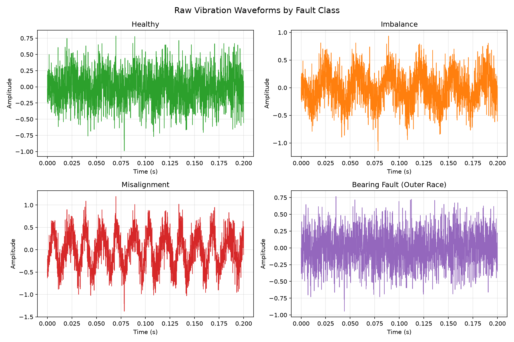
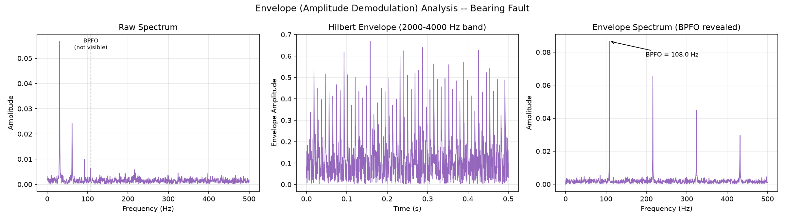
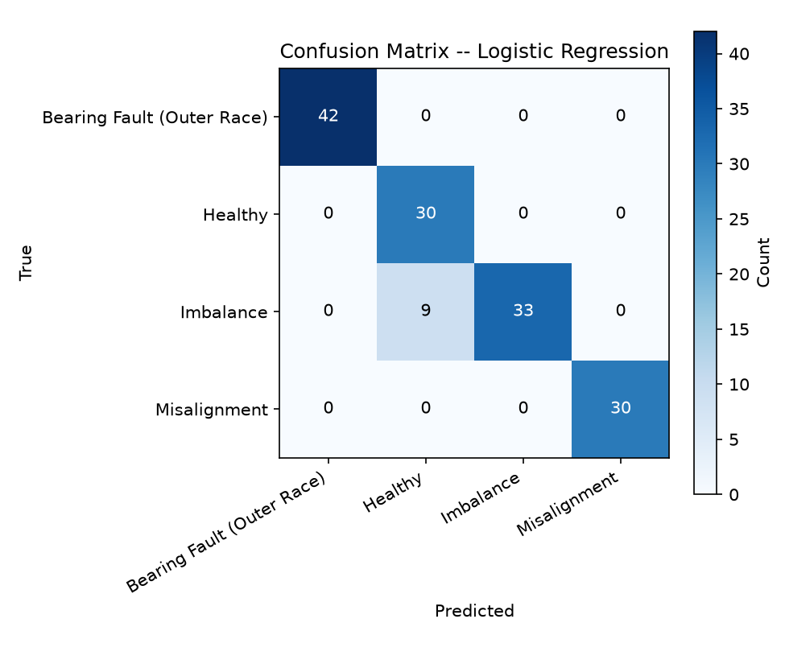

# Motor Fault Detection Using Time-Frequency Signal Processing and Machine Learning

A sophomore Signals & Systems mini-project that generates physics-based synthetic motor
vibration signals for four conditions (healthy, imbalance, misalignment, bearing fault),
analyzes them with classic DSP tools (FFT, PSD, STFT, Hilbert envelope demodulation,
autocorrelation, Butterworth filtering), extracts a tidy feature table, and trains/compares
three standard classifiers (Logistic Regression, SVM, Random Forest) to identify the fault
type from a vibration recording.

## Pipeline

```
signal_model.py  --> preprocessing.py  --> spectral.py   --> features.py
(synthetic          (detrend, filter,     (FFT, PSD,        (time + freq +
 vibration data)      convolution,         STFT, Hilbert      envelope features,
                       autocorrelation)     envelope,          windowed 1s/50%)
                                            Parseval check)
        |                                                          |
        v                                                          v
   figures/01-07                                            dataset.py
   (waveforms, filter                                     (feature table,
    response, spectra,                                     optional CWRU
    spectrogram, envelope,                                  real-data hook)
    autocorrelation, Parseval)                                    |
                                                                    v
                                                             classify.py
                                                      (GroupShuffleSplit by
                                                       recording, 3 models,
                                                       GroupKFold CV)
                                                                    |
                                                                    v
                                                     figures/08-11 + console report
                                                (feature boxplots, model comparison,
                                                 confusion matrix, feature importance)
```

`run_all.py` runs every stage above in order and prints a narrated log.

## Install & Run

```bash
python -m venv .venv
# Windows
.venv\Scripts\activate
# macOS/Linux
source .venv/bin/activate

pip install -r requirements.txt
python run_all.py
```

Runs end-to-end in well under a minute on a laptop CPU. Figures land in `figures/`,
the extracted feature table in `data/processed/features.csv`.

## Results

Recording-level 70/30 train/test split (`GroupShuffleSplit` on `recording_id`, so no
window from the same recording appears on both sides):

| Model               | Accuracy | Precision (macro) | Recall (macro) | F1 (macro) |
|----------------------|:--------:|:------------------:|:---------------:|:-----------:|
| Logistic Regression | 0.938    | 0.942              | 0.946           | 0.937       |
| SVM (RBF)            | 0.903    | 0.910              | 0.914           | 0.902       |
| Random Forest        | 0.938    | 0.942              | 0.946           | 0.937       |

Best model (Logistic Regression) 5-fold `GroupKFold` cross-validation accuracy:
**0.946 ± 0.030**.

Most confusion happens between `imbalance` and `healthy` at the low-severity end of the
imbalance range -- a mild unbalance genuinely looks close to a healthy machine, which is
physically correct, not a bug in the classifier.

### Selected figures

| Raw waveforms by class | Envelope analysis reveals the hidden bearing fault |
|:---:|:---:|
|  |  |



## Data

All signals are **physics-based synthetic models**, not recorded data. Each recording is a
sum of shaft-rate harmonics (1x/2x/3x) with class-specific amplitude patterns, additive
white Gaussian noise, and -- for the bearing-fault class -- a periodic impulse train at the
outer-race ball-pass frequency (BPFO), where each impulse excites a damped ~3 kHz structural
resonance (the impulse response of an underdamped 2nd-order system). Shaft speed, phases,
noise level, and harmonic/fault amplitudes are all randomized per recording so classes
genuinely overlap, the way real machines do.

`src/dataset.py` also includes an **optional** hook, `load_cwru_if_available()`, that will
run real Case Western Reserve University bearing-fault `.mat` files through the identical
feature pipeline if you drop them into `data/raw/`. If that folder is empty (the default),
the pipeline prints one line saying real-data validation was skipped and continues normally
-- it never downloads anything.

## Limitations

- Signals are synthetic; real vibration data has additional non-idealities (sensor
  mounting resonances, gear mesh frequencies, non-Gaussian noise, non-stationary speed)
  that this model doesn't capture.
- Only one bearing fault type (outer race) is modeled; inner-race and rolling-element
  faults have different characteristic frequencies and aren't included.
- Shaft speed variation is limited to ±5% around a single nominal RPM; the feature set
  isn't validated across a wider operating-speed range.
- Class balance is artificial (40 recordings/class); real fault data is usually far more
  imbalanced toward "healthy."

## Project layout

```
motor-fault-detection/
├── run_all.py              # runs the entire pipeline, prints a narrated log
├── src/
│   ├── signal_model.py     # synthetic vibration signal generation
│   ├── preprocessing.py    # detrend, filtering, convolution demo
│   ├── spectral.py         # FFT, PSD, STFT, Hilbert envelope
│   ├── features.py         # time + frequency feature extraction
│   ├── dataset.py          # build labelled feature table, optional CWRU loader
│   ├── classify.py         # train/compare/evaluate models
│   └── plots.py            # all figure generation
├── data/                   # raw/ gitignored; processed features.csv committed
├── figures/                # all PNGs, numbered
└── docs/walkthrough.md     # stage-by-stage explanation + SNS syllabus mapping
```
